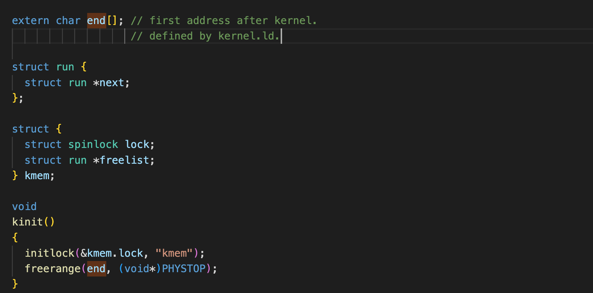
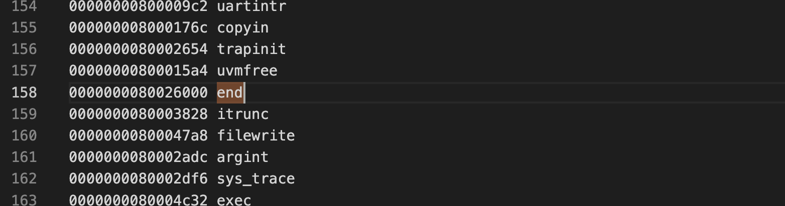

### page tables（第三章笔记）

页表用于给每个进程提供自己独立的地址空间和内存，保证了进程间的地址隔离和虚拟化。

* xv6采用的39bit虚拟地址， 高27位作为三层页表的pte index.
* walk用于找到指定虚拟地址的PTE
* mappages用于将新的PTE写入新的虚拟地址和物理页的映射关系。
* kvm打头用于操作内核页表，uvm开头的用于操作用户页表
* 在boot阶段，main函数调用kvminit，在kvminit中创建内核页表。
* 内核页表各部分意义解释
  * UART registers：universal async registers/transmitters，简而言之就是将外设传送给cpu的并行数据转化为串行数据。
  * Virtio mmio disk: 简而言之就是虚拟化（virtual machine）映射外设的一种方式，mmio指的是内存映射IO
  * 之后就是CLINT和PLIC:目前大致知道这个是负责RISC-V终端的两个控制器就好了，RISC-V暂时不支持嵌套中断，所以中断方式还是比较明朗的，到后面仔细阅读RISC-V手册，可以把这些内容给补上
  * 之后都是相同的对应映射
* 之后调用kvmmap将对应部分从虚拟地址映射到实际的物理地址上，这个时候因为还没有开启分页机制，所以其实虚拟地址和物理地址都是相等的映射。
* kvmmap具体的流程
  * 调用mapmapges，将va到va + sz的每个整数倍页大小起点映射到pa开始的物理地址（PGROUNDDOWN), 每次去va对应的9位得到分层页表的PPN(物理页号)， 此时因为没有开启分页机制，所以得到物理页内容可以直接当做虚拟地址来用，最后返回最后一级页表中的pte。
  * 加入对应pte的valid flag没有设置，那么说明这个物理页是无效的，如果调用参数允许分配，就在该位置重新分配一个物理页作为新页表。
* main流程调用玩kvminit之后，需要调用kvminithart，具体作用是将内核页表的位置写入satp寄存器，然后刷新TLB的cache
* 之后就是在main函数中调用procinit，为每一个进程都分配一个物理页，映射到虚拟地址的高位，虚拟地址由KSTACK和进程在进程数组中的index决定。这一页的内容暂时还没有在这个方法里面进行写操作，之后需要进行写操作的时候，直接按照进程的index获取kernel stack的虚拟地址即可获得对应的物理地址。
* 调用完procinit之后需要再次执行kvminithart，因为之前的pte可能会失效，访问到其他进程所占用的物理页就不太好了（当然需要进程间的通信就另外一说）。
* 物理内存的分配：xv6的物理内存分配是由一个链表来管理的，分配出去一个页，就将这一页从空闲链表中移除，释放掉一个页，就将这个页加入到链表中。
* 初始化的时候首先初始化kernel end到PHYSTOP之间的物理页到空闲链表中，起始点定义如题：



这个end，定义在kernel.ld文件中，ld文件格式是由GNU linker command所构成的脚本，实际上end的数值就是kernel.symbol中定义的数值。



* 进程的地址空间，就是从0开始到MAXVA(由RISCV的39位决定)，在代码段和数据段的上方，再加上一个guard page, 栈大小刚好为一个page size，stack自顶向下增长，溢出则会报page fault，但是在实际的操作系统中，可能会分配更多的物理内存给栈。

**sbrk系统调用**

sbrk系统调提供给进程，用于增长或者减小其内存，调用层级关系是```sbrk -> uvmalloc/uvmdealloc -> kalloc/(walk -> kfree)```, 进程页表除了作为映射虚拟地址到物理地址的关系，还记录了每个进程分配了多少物理页。


