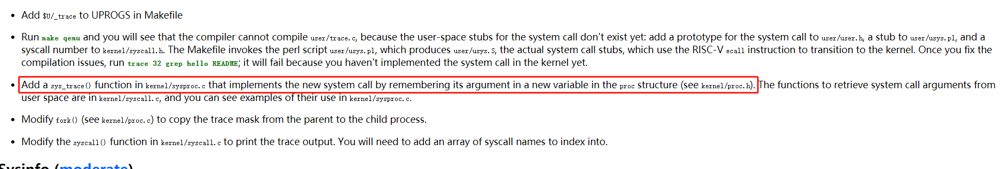
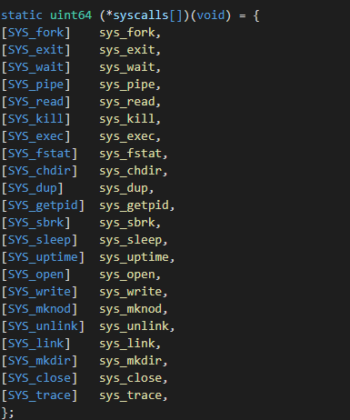

## Syscall Lab

> 最开始的时候有点不太清楚流程，按照实验手册上面写的卡住了。
>
> 后面发现其实还是蛮清楚的，按照第四章的内容来做还是比较简单的。

### trace

按照实验手册一步步来就可以了，中间有一个部分：



当初有点犹豫这个mask应该加在结构体的哪一部分，结果是直接添加一个新的变量在proc结构体里面。

* 另外一个是有点疑问，为什么系统调用函数指针的数组可以从下标为1开始（这个等进群之后再问吧）。



最后得知这里是[GCC过时标准](https://gcc.gnu.org/onlinedocs/gcc/Designated-Inits.html)

### syscall

* 这里本来想着可不可以直接进行指针类型转换，读取指针之后直接给对应内容赋值，这样就不用做copyout了，我感觉理论上似乎是可以的，但是后面因为编译器报错而放弃尝试，使用copyout不会有出现指针转换而编译出错的情况。
* 另外就是新加的两个函数需要在def.h里面再声明一下。
* 最后再回顾一下```extern```的用法，declaration只表示存在性，而真正分配内存是definition。

对于函数而言是默认带explicit，普通变量不是，所以“声明”变量的同时也为其分配了内存空间。如果explicit声明了变量或者函数但是使用的时候发现找不到定义，这样链接的时候就会出错。

* 关于copyout，对着实验文档里面给的例子照葫芦画瓢即可。