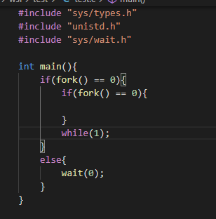
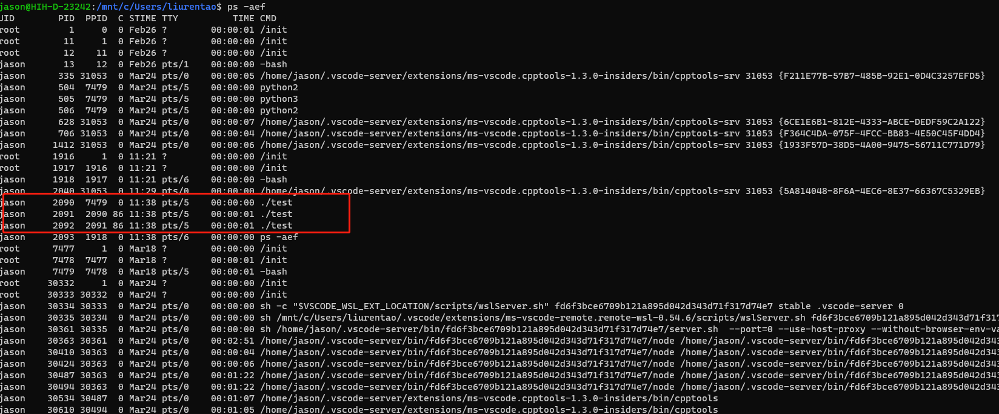
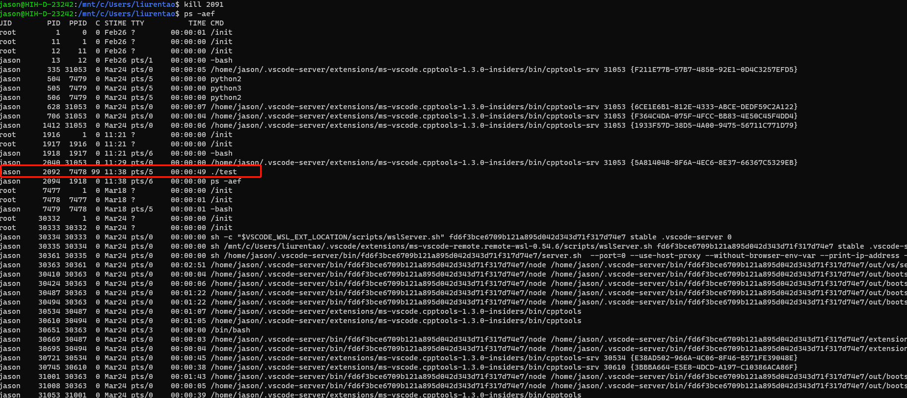
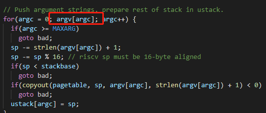

### Lab notes

#### ping pong

> need to add space or output format would not fit the criteria.

#### prime

* Use a specific prime sieve. When confirming one number is a prime, other number which is divisible by that prime is not a prime and we do not need to transport it to the next process. When 

> question: After parent process exits, child process is still alive?

* Yes, after parent process died, the child process become the child of the **init** process.

* Read pipe and write pipe are different cause without multiple pipes, processes will mess up one single pipe.

> will grand process wait for grandson process?

* No, look at the example below.

process information:

after kill child process.

之后测试的时候有一个很脑残的错误，写管道的时候，写的是原来的管道，原来的gdb还有内部bug，肉眼找bug花了好久时间。

* find

大致思路应该还是枚举和筛选，先找出本目录下的文件进行筛选，如果是文件就进行比对，如果是目录就进行递归调用。

讲一下出现的几个问题，照搬ls里面的fmtname函数，这里的问题主要是函数会返回一个定长的字符串指针，文件名不够的地方用空格补全，这样strcmp肯定不会返回0，所以删去补齐空格的memset函数就好，最后还要再末尾加上一个串尾符。

另外就是不要递归回上级目录和本机目录，至于比较的话可直接使用dirent结构里面的name。

* xargs

这个我不是太熟，看了一下manual手册，感觉就是把管道左边的写入的内容作为管道右边命令的参数。

具体步骤就是先读取原有的命令参数，然后再从标准输入中读取其他参数（遇到换行执行一次）

最后执行的指令（一个字符串数组）最后一个位置要加0，原因如下。

* 期间还试过一次按照字典序排列头文件，结果有声明依赖...
* 其实还是比较好奇：xargs怎么忽略掉前面的指令的（得去看sh.c的代码）