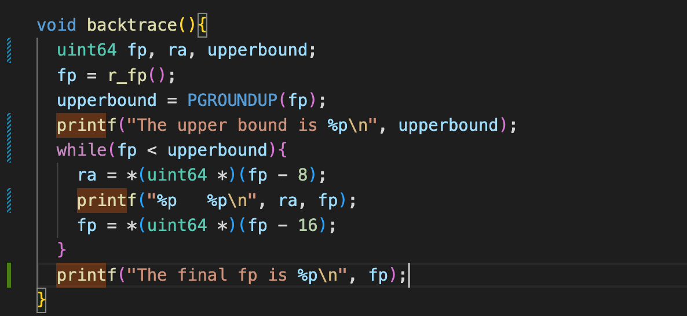
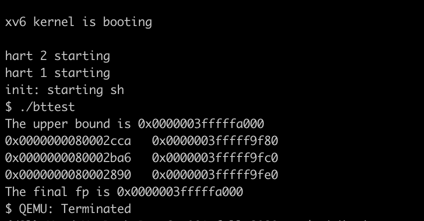

### XV6 book traps笔记

* 三种事件会打断cpu令正常执行去处理这些事件，系统调用，指令引发的异常，以及外部硬件的中断。
* xv6用trap统一代替代替以上提到的这三种情况，我们希望被中断的执行代码对于自己的执行被traps中断这件事是不知情的（透明的）
* 大致流程：
  * trap transfer control to kernel
  * kernel saved registers and states need to resumed later
  * kernel execute handler code
  * kernel restored saved state and register, finally return from trap.
  * the original code resume executing
* traps一般分为三类：user space发生的，kernel space发生的以及时钟trap。
* RISC-V与trap有关的寄存器：
  * stvec: trap handler的地址，由kernel写入。RISC-V汇编就会跳转到这个寄存器指向的地址进行trap处理。
  * sepc：之前被中断程序pc指向的位置，从trap中返回时，kernel会将sepc的值写入pc寄存器
  * scause: 存储发生trap的原因标号
  * sscratch: 没有说具体，书上只提到了trap handle最开始的时候会用到。
  * sstatus: 含有各种标记位，SIE表示是否允许硬件中断，SPP标识trap是来自于user mode还是supervisor mode.

#### traps lab part 1

问答写在对应仓库的answer文件里了

#### part 2 backtrace

这里比较关键的地方就是如何跳出打印return address的循环，在gdb中我们可能有额外的栈帧信息来帮助我们判断调用的层级，但是xv6就比较简单，只分配给用户进程一个页作为栈，所以当fp指向那一页的栈顶时，说明已经到达了最底层的函数调用栈。

**这里我们可以做一个测试，在循环开始之前打印出该页的开始地址，PGROUNDUP(fp)，因为栈是从上往下增长的，所以最终我们需要检测fp的值是否与这个值相等**

最后得到的结果：

我们可以看到final fp和这个栈帧的顶部是相同的，猜想成立（之所以用printf还是因为gdb有时候断不到）